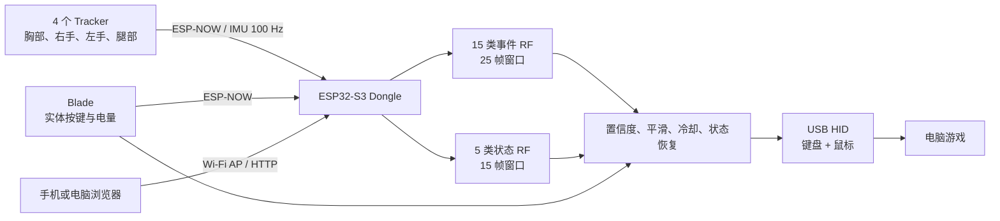

# MoveToPlay 工程交接总结

MoveToPlay 是一套基于 ESP32-S3 的多人穿戴式体感控制系统：四个 Tracker 采集身体 IMU 数据，Blade 提供实体按键状态，Dongle 汇总所有无线数据，在本地完成动作识别和逻辑后处理，最终模拟 USB 键盘和鼠标控制电脑游戏。

目前它已经是完整的业务原型，不再是 README 所描述的“ESP-IDF 基础模板”。

## 1. 当前仓库状态

- 分支：`main`
- 远程仓库：`https://github.com/huheran/MoveToPlay.git`
- 最新提交：`def112b`，2026-07-18
- 工程历史：78 个提交，主要开发者为 `hhr` 和 `Rowlexting`
- ESP-IDF：5.5.2
- 芯片：ESP32-S3
- 默认 Flash：8 MB
- 当前工作区存在一处未提交修改：

```c
#define M2P_BOARD_PROFILE 2
```

也就是当前源码被切换成了 Blade 固件。提交版本原本是 `1`，即 Dongle。

本次检查没有修改源码，只重跑了构建。当前 Blade 配置构建成功：

- 固件大小：772,944 字节
- App 分区：7 MB
- 分区剩余约 89%
- 唯一编译警告：`print_csv_header()` 未使用
- 全部 Python 脚本通过语法检查
- 尚未进行实机通信、USB HID 和动作识别验证

最重要的编译入口位于 `main/app_main.c`。

---

## 2. 整体架构



系统包含六种可烧录角色：

| Profile | 角色 | 节点 ID | 用途 |
|---:|---|---:|---|
| 1 | Dongle | — | 接收、识别、USB HID 输出 |
| 2 | Blade | 100 | 实体按键、视角控制使能、休眠 |
| 3 | Chest Tracker | 1 | 胸部 IMU |
| 4 | Right Hand Tracker | 2 | 右手 IMU |
| 5 | Left Hand Tracker | 3 | 左手 IMU |
| 6 | Leg Tracker | 4 | 腿部 IMU |

所有角色共用同一个 `main/app_main.c`，通过宏裁剪出不同固件。

---

## 3. 各设备职责

### Tracker

每个 Tracker：

- 通过 SPI 读取 LSM6DSV 六轴 IMU。
- IMU 配置为约 120 Hz ODR，任务按 100 Hz 读取。
- 读取加速度 `ax/ay/az`，单位 g。
- 读取陀螺仪 `gx/gy/gz`，单位 dps。
- 每个有效样本通过 ESP-NOW 广播给 Dongle。
- 每 5 秒读取一次电池电压并附带到数据包。
- SK6812 灯显示电量，并每 2 秒短暂熄灭一次作为心跳。
- IMU 初始化失败时快速闪灯三次并循环。

IMU 驱动见 `main/imu_lsm6dsv.c`。

### Blade

Blade 当前只有按键和电量，没有使用 IMU：

- GPIO4，低电平按下。
- 50 Hz 消抖轮询。
- 松开时按 5 Hz 发送心跳。
- 按下时按 25 Hz 上报。
- 状态变化时连续发送三次，减少无线丢包影响。
- 按住 Blade 时，Dongle 使用胸部 Tracker 的陀螺仪控制水平和垂直视角。
- Blade 本身目前不直接输出鼠标点击。

休眠手势：

1. 连续短按四次；
2. 每次间隔不超过 700 ms；
3. 第五次按住 5 秒；
4. 进入深度睡眠。

唤醒后还需要继续按住 3 秒确认，否则重新休眠。

### Dongle

Dongle 完成系统的大部分业务逻辑：

- 接收 Tracker 和 Blade 的 ESP-NOW 数据。
- 保存各节点最新状态、电量、时间和序号。
- 每 40 ms，即 25 Hz，构造一次四节点识别帧。
- 运行事件模型和状态模型。
- 做置信度门限、连续帧确认、动作冷却和状态恢复。
- 输出 USB 键盘与鼠标报告。
- 提供 Wi-Fi 状态与动作配置页面。
- 将动作配置持久化到 NVS。

---

## 4. 硬件引脚

板型定义位于 `main/move_to_play_board_config.h`。

### 旧版 Tracker 板

| 功能 | GPIO |
|---|---:|
| SPI SCLK | 12 |
| SPI MOSI | 11 |
| SPI MISO | 9 |
| SPI CS | 10 |
| SK6812 | 38 |
| 电池 ADC | GPIO4 / ADC1_CH3 |

### 新版 Tracker 板

| 功能 | GPIO |
|---|---:|
| SPI SCLK | 13 |
| SPI MOSI | 12 |
| SPI MISO | 11 |
| SPI CS | 14 |
| SK6812 | 38 |
| 电池 ADC | GPIO2 / ADC1_CH1 |

当前四个 Tracker 的 `BOARD_STYLE` 都设为 `1`，即新版板。

Blade 和 Dongle 会复用 Chest 的板型配置，因此当前：

- Blade 按键：GPIO4
- Blade 电池：GPIO2
- Dongle Wi-Fi 维护模式按钮：GPIO4
- 状态灯：GPIO38

---

## 5. ESP-NOW 通信协议

协议定义见 `main/m2p_espnow.h`。

关键参数：

- 固定 Wi-Fi 信道：6
- 发射功率：10 dBm
- 广播地址：`FF:FF:FF:FF:FF:FF`
- 不加密、不配对
- 接收队列长度：16
- 协议当前版本：2
- 最低兼容版本：1
- 单包约 44 字节

包内容包括：

- Magic：`M2PN`
- 协议版本
- 包类型
- 节点 ID
- 标志位
- 发送序号
- 设备时间戳
- 六轴 IMU
- 电池电压
- 电池百分比

包类型：

- `TRACKER_IMU`
- `BLADE_STATE`

版本 2 在版本 1 的 40 字节基础上增加电池字段，代码保持了向后兼容。

需要注意：

- 没有设备身份认证。
- 没有应用层校验和。
- 没有序号去重或乱序处理。
- 广播数据可被同信道上的其他设备接收或伪造。
- 队列满时新包会被静默丢弃。

---

## 6. 动作识别

### 输入结构

模型要求四个 Tracker 全部在线：

1. Chest
2. Right Hand
3. Left Hand
4. Leg

任一节点未收到数据或最后数据超过 250 ms，当前帧不推理。

每个节点使用八个通道：

- `ax, ay, az`
- `gx, gy, gz`
- 加速度模长
- 陀螺仪模长

### 特征工程

模型共使用 812 个特征：

- 单节点统计：4 × 8 × 10 = 320
- 六组节点对差值统计：6 × 8 × 10 = 480
- 节点对模长相关系数：6 × 2 = 12

合计 812。

每个通道的十个统计特征包括：

- 均值
- 标准差
- 最大值
- 最小值
- 极差
- RMS
- 能量
- Jerk 平均绝对值
- Jerk 标准差
- Jerk RMS

### 双模型融合

#### 事件模型

- 窗口：25 帧，约 1 秒
- 随机森林：180 棵树
- 节点总数：61,776
- 类别数：15

类别：

```text
hands_cross_forehead
hands_press_down
hands_shoot
idle
jump
kick
left_hand_raise
move_noise
right_hand_raise
right_hand_slash
run
turn_left
turn_right
ultraman_beam
walk
```

#### 状态模型

- 窗口：15 帧，约 600 ms
- 随机森林：50 棵树
- 节点总数：11,744
- 类别数：5

类别：

```text
idle
move_noise
right_hand_slash
run
walk
```

融合规则：

1. 如果事件模型识别到非状态动作，优先采用事件模型。
2. 否则采用状态模型。
3. 如果状态模型无效，再退回事件模型结果。

固件实现见 `main/rf_infer.c` 和 `main/rf_state_infer.c`。

---

## 7. 识别后处理

Dongle 并不是识别出什么就立即发送什么，还加入了较多游戏控制规则：

- 默认置信度门限：60%
- 跳跃有效门限最多按 40% 处理
- 行走/奔跑有效门限最多按 52% 处理
- 普通动作连续确认三帧
- 新进入行走/奔跑需要连续四帧
- 左右转不经过普通平滑，减少视角延迟
- 左转后 800 ms 内阻止立即反向右转，反之亦然
- 事件动作发生后，可在 200 ms 内恢复先前行走/奔跑状态
- 事件与状态的桥接窗口为 320 ms
- Blade 松开后，最多保留移动按键 220 ms
- 移动中跳跃会发送 `W+Space` 或 `Shift+W+Space`，避免跳跃时丢失前进状态
- 支持冷却、边沿、持续帧和重复四种触发模式

这些逻辑主要集中在 `main/app_main.c`。

---

## 8. 默认动作映射

| ID | 动作 | 默认输出 | 触发方式 |
|---:|---|---|---|
| 0 | 双手交叉额头 | 依次循环数字键 1/2/3/4 | 新出现，800 ms |
| 1 | 双手下压 | F | 冷却 600 ms |
| 2 | 双手射击 | 鼠标右键按住 500 ms | 新出现 |
| 3 | 空闲 | 无 | — |
| 4 | 跳跃 | Space | 新出现，1000 ms |
| 5 | 踢 | E | 冷却 1000 ms |
| 6 | 左手抬起 | M | 新出现，800 ms |
| 7 | 动作噪声 | 无 | — |
| 8 | 右手抬起 | X | 新出现，800 ms |
| 9 | 右手挥砍 | 鼠标左键点击 | 每 500 ms 重复 |
| 10 | 奔跑 | Shift+W 按住 | 状态保持 |
| 11 | 左转 | 鼠标左移 | 每 40 ms |
| 12 | 右转 | 鼠标右移 | 每 40 ms |
| 13 | 奥特曼光线 | Q | 冷却 1000 ms |
| 14 | 行走 | W 按住 | 状态保持 |

这些只是默认值。最终值可能已被写入 Dongle NVS，运行时会优先加载 NVS 配置。

---

## 9. Blade 视角控制

按住 Blade 且 Blade 数据不超过 300 ms 时：

- 胸部 `gy` 控制鼠标 X，即左右视角。
- 胸部 `gx` 控制鼠标 Y，即上下视角。
- 水平死区：8 dps
- 垂直死区：8 dps
- 水平灵敏度：10 像素/积分角度
- 垂直灵敏度：8
- 单次水平最大变化：80
- 单次垂直最大变化：64
- 胸部数据必须在 150 ms 内
- 约每 20 ms 输出一次鼠标报告

按住 Blade 时，该逻辑优先于模型识别出的左右转动作。

---

## 10. Dongle 的三种模式

由 `M2P_DONGLE_MODE` 决定：

| 模式 | 值 | 串口 | 推理 | USB HID | 用途 |
|---|---:|---|---|---|---|
| Serial View | 0 | 状态和调试日志 | 开启 | 关闭 | 看识别结果 |
| Data Collect | 1 | 原始 CSV | 关闭 | 关闭 | 采集训练数据 |
| Play | 2 | 少量状态日志 | 开启 | 开启 | 正式游戏 |

当前宏为 `2`，但当前 Profile 是 Blade，所以这个值暂时不生效。

---

## 11. Wi-Fi 配置与维护模式

Dongle 正常运行时，长按 GPIO4 四秒进入 Wi-Fi 模式：

- SSID：`MoveToPlay-Dongle`
- 无密码
- 地址：`http://192.168.4.1/`
- 状态灯变蓝
- 暂停 RF 推理和 HID 输出
- USB 从 TinyUSB HID 切换为硬件 USB Serial/JTAG，便于维护和重新烧录
- Tracker 状态更新降频到每节点 200 ms

页面可查看：

- 八个 Tracker 槽位的在线状态
- Blade 在线和按键状态
- 电池百分比和电压
- 最后数据时间
- 序号和运行时间

可配置每个动作的：

- 输出类型
- 键盘键
- 修饰键
- 触发方式
- 置信度
- 冷却时间
- 持续帧数

保存后写入 NVS：

- Namespace：`m2p_dongle`
- Key：`actions`
- 配置版本：1

再次长按 GPIO4 四秒会重启并退出 Wi-Fi 模式。

HTTP 接口：

```text
GET  /
GET  /api/status
GET  /api/config
POST /api/config
POST /api/config/reset
```

当前 AP 和配置接口均无认证，只适合封闭现场环境。

---

## 12. USB HID

USB 模块模拟一个组合设备：

- 厂商字符串：`MoveToPlay`
- 产品字符串：`MoveToPlay HID KM`
- 键盘 Report ID：1
- 鼠标 Report ID：2
- 轮询间隔：1 ms
- 单次发送等待上限：100 ms

代码位于 `main/usb_keyboard.c`。

USB 模式切换要特别注意：

- Play 模式下电脑看到的是 HID 键盘和鼠标。
- 进入 Wi-Fi 维护模式后，TinyUSB 会被卸载，切换为 USB Serial/JTAG。
- 想退出维护模式需要长按按钮重启。
- 如果 Dongle 无法被正常识别，首先检查烧录的是否真的是 Profile 1 + Play 模式。

---

## 13. 电量与 LED

电量计算当前较简单：

- 分压比固定为 2.0
- 4.2 V 映射为 100%
- 3.0 V 映射为 0%
- 中间线性插值
- 无多点校准
- 无滤波和滑动平均

Tracker LED：

- 75%以上：绿色
- 50%～75%：黄色
- 25%～50%：橙色
- 25%以下：红色
- 每两秒短暂熄灭一次表示仍在运行

这套计算更适合作为粗略状态提示，不能当成精确剩余容量。

---

## 14. 目录与模块说明

| 路径 | 职责 |
|---|---|
| `main/app_main.c` | 角色选择、任务启动、Dongle 全部业务逻辑 |
| `main/imu_lsm6dsv.*` | LSM6DSV SPI 驱动 |
| `main/m2p_espnow.*` | ESP-NOW、Wi-Fi 和协议 |
| `main/rf_infer.*` | 15 类事件模型推理 |
| `main/rf_state_infer.*` | 5 类状态模型推理 |
| `main/generated/` | 已部署的 RF C 数组 |
| `main/usb_keyboard.*` | TinyUSB 键盘和鼠标 |
| `main/battery_monitor.*` | ADC 电池采样 |
| `main/status_led.*` | RMT 驱动 SK6812 |
| `tools/collect_imu_data.py` | 旧版状态标签数据采集 |
| `tools/collect_imu_events.py` | 当前事件/状态联合采集 |
| `tools/train_event_rf.py` | 当前 RF 训练入口 |
| `tools/export_rf_model_c.py` | joblib 模型导出为固件 C 数组 |
| `tools/retrain_models.sh` | 当前两个部署模型的训练命令备份 |
| `tools/rf_baseline.py` | 早期 RF 基线 |
| `tools/cnn1d_train.py` | CNN 训练实验 |
| `tools/imu_*` | 串口监控、姿态融合、动作可视化 |
| `analysis/` | 跳跃误识别诊断脚本 |

值得注意：CNN 相关源文件虽然还在，但没有被 `main/CMakeLists.txt` 编译。当前正式固件只使用两个随机森林。

---

## 15. 构建和烧录

推荐使用 ESP-IDF 5.5.2 PowerShell 环境。普通 PowerShell 没有自动设置 `IDF_PATH`，直接构建会失败。

标准流程：

```powershell
# 先在 app_main.c 修改 M2P_BOARD_PROFILE
# Dongle 还要确认 M2P_DONGLE_MODE

idf.py build
idf.py -p COMx flash monitor
```

独立 8 MB 构建：

```powershell
idf.py -B build-tracker8mb `
  -D "SDKCONFIG=build-tracker8mb/sdkconfig" `
  -D "SDKCONFIG_DEFAULTS=sdkconfig.defaults.8mb" build

idf.py -B build-tracker8mb -p COMx flash monitor
```

16 MB Dongle：

```powershell
idf.py -B build-dongle16mb `
  -D "SDKCONFIG=build-dongle16mb/sdkconfig" `
  -D "SDKCONFIG_DEFAULTS=sdkconfig.defaults.16mb" build
```

默认 8 MB 分区：

- NVS：24 KB
- PHY：4 KB
- Factory App：7 MB

16 MB 配置的 Factory App 为 15 MB。

目前没有 OTA 分区，所有升级都依赖有线烧录。

此外，工程名称仍是 `esp_idf_template`，所以输出文件也是：

```text
build/esp_idf_template.bin
```

这属于历史遗留命名。

---

## 16. 数据采集与模型训练

当前推荐链路：

1. 将 Dongle 设为 Profile 1。
2. 将 `M2P_DONGLE_MODE` 设为 Data Collect。
3. 四个 Tracker 全部上线。
4. 使用 `collect_imu_events.py` 收集样本和事件标记。
5. 按 40 ms 时间网格对齐四个节点。
6. 使用 `train_event_rf.py` 分别训练状态模型和事件模型。
7. 使用 `export_rf_model_c.py` 导出 C 数组。
8. 重新编译 Dongle 固件。
9. 用实机串口和 HID 行为验证。

当前训练命令记录在 `tools/retrain_models.sh`。

一个严重的可复现性问题是，该脚本依赖：

```text
data/processed/event_samples_combined_slash_full.csv
data/processed/event_events_combined_slash_full.csv
```

但这两个文件当前不存在。

同时：

- `data/`
- `model/`
- `output/`
- `main/generated/`

都被 `.gitignore` 忽略，不过已被 Git 跟踪的 RF 生成文件仍会保留。

因此全新克隆仓库后：

- 可以拿现有生成数组编译固件；
- 不能完整复现当前模型训练；
- 训练原始数据、joblib、训练报告和混淆矩阵可能缺失。

当前本地 `model/rf_model_meta.json` 还是旧的十分类模型信息，与固件中的十五分类模型不一致，不应把它当成当前部署模型。

Python 依赖也没有 `requirements.txt`。从代码看至少涉及：

```text
pyserial
pynput
numpy
pandas
scikit-learn
joblib
matplotlib
seaborn
torch
```

---

## 17. 主要风险与技术债

### 高优先级

#### 1. 编译角色依靠手工修改源码

每烧一块板都要改 `M2P_BOARD_PROFILE`，非常容易把 Blade、Tracker 或 Dongle 固件烧错，也会长期产生脏工作区。

建议改成 Kconfig、CMake 参数或独立构建预设。

#### 2. 缺少完整构建矩阵

C 预处理会裁掉其他角色代码。成功构建 Blade 不代表 Dongle、四个 Tracker 和三种 Dongle 模式都能编译。

至少应在 CI 中构建：

- Dongle View
- Dongle Collect
- Dongle Play
- Blade
- 四个 Tracker Profile

#### 3. 模型不可完整复现

当前训练数据、模型 bundle 和训练报告不在 Git 中，重训脚本引用的输入也缺失。

需要把数据放进明确的数据归档、对象存储或发布包，并记录数据版本和模型哈希。

#### 4. README 严重过时

README 开头仍声称这是基础 LED 模板，且包含无意义测试文本。下一任不能依赖现有 README 理解系统。

### 中优先级

#### 5. `app_main.c` 过于庞大

文件接近 3,900 行，混合了：

- 角色配置
- 无线接收
- 推理
- HID
- Web 页面
- NVS
- Blade 休眠
- 电量
- 任务管理

建议拆成 `dongle_runtime`、`action_mapper`、`web_config`、`blade_runtime`、`tracker_runtime` 等模块。

#### 6. 无自动化测试

当前没有：

- C 单元测试
- 协议编码/解码测试
- RF C/Python 一致性测试
- HID 状态机测试
- Web 配置测试
- CI 配置

#### 7. 无线和配置接口无安全保护

ESP-NOW 广播不加密，SoftAP 无密码，配置接口无认证。现场附近的其他设备理论上可以干扰或修改配置。

#### 8. USB、Wi-Fi 和 HID 耦合较强

进入 Wi-Fi 页面会暂停推理、释放按键并切换 USB 模式。这是有意设计，但接手者很容易误以为设备“停止识别”或“USB 消失”。

### 较低优先级

9. 电量模型粗糙，缺少滤波和板级校准。

10. Tracker 没有深度睡眠，只有 Blade 实现省电。

11. 无 OTA，仅有一个 Factory App 分区。

12. 协议时间戳为 32 位微秒，大约 71.6 分钟回绕。

13. ESP-NOW 接收队列满时静默丢包，缺少丢包计数和链路质量指标。

14. 依赖已有更新版本，但当前锁定版本可正常构建：

```text
esp_tinyusb 2.1.1，可更新到 2.2.1
tinyusb 0.19.0~2，可更新到 0.21.0~1
```

不建议接手第一天立即升级，应先建立硬件回归测试。

---

## 18. 建议下一任接手顺序

### 第一阶段：先保证可控

1. 确认当前未提交的 Blade Profile 修改是否需要保留并提交。
2. 分别给六种硬件建立明确的构建命令或脚本。
3. 更新 README，记录设备照片、串口号、MAC、安装位置和烧录版本。
4. 对现有成套硬件完成一次端到端测试。
5. 备份当前可以正常工作的固件二进制。

### 第二阶段：补齐可复现性

1. 找回 `data/processed` 中部署模型对应的数据。
2. 找回两个 RF 的 joblib、训练摘要和混淆矩阵。
3. 建立 `requirements.txt` 或 Conda 环境。
4. 给模型数据、生成数组和固件建立共同版本号。
5. 增加 Python 模型和 C 推理结果一致性测试。

### 第三阶段：再做重构

1. 拆分 `app_main.c`。
2. 用 Kconfig 或构建参数替代源码角色宏。
3. 增加 CI 构建矩阵。
4. 加入协议统计、丢包率和节点版本信息。
5. 评估 ESP-NOW 加密、AP 密码和配置认证。
6. 评估 OTA 和双分区升级。

## 一句话交接结论

目前系统的核心闭环已经完整跑通：四节点体感采集、无线汇聚、双随机森林识别、Blade 辅助控制、USB 键鼠输出和网页配置都已经实现。最大的接手风险不是某一个算法，而是“角色靠手改宏、主文件过大、模型训练资产不完整、缺少全角色自动化验证”。接手者应先固化构建与数据版本，再继续优化识别效果或扩展功能。
