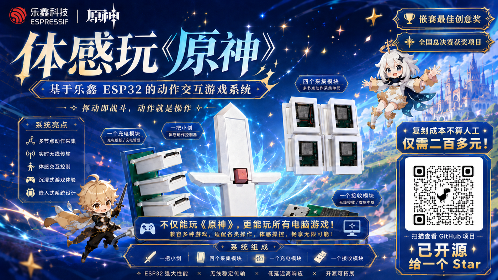

<p align="center">
  
</p>

# MoveToPlay

> Turn your body into a controller.

English · [简体中文](README.md)

[](LICENSE)
[]()
[]()
[]()

MoveToPlay is an open-source motion controller built on the ESP32-S3. Strap a Tracker to your chest, both hands, and a leg, hold a sword-shaped Blade, and the Dongle plugged into your PC figures out when you jump, slash, or run — then presses the right key for you. No keyboard, no gamepad, just your body.

## Contents

- [What it does](#what-it-does)
- [The three devices](#the-three-devices)
- [How to play](#how-to-play)
- [Hardware](#hardware)
- [Firmware](#firmware)
- [Windows Companion](#windows-companion)
- [Training your own moves](#training-your-own-moves)
- [Cloud training service](#cloud-training-service)
- [Repository layout](#repository-layout)
- [License](#license)

## What it does

Swing at the screen and your character attacks. Jump in place and they jump. Start walking and they walk. Recognized moves are emitted as real keyboard and mouse input, so any PC game works — you just map each move to a key.

The default mapping is tuned for Genshin Impact and works out of the box:

| Move | Default output |
| --- | --- |
| idle / move noise | nothing |
| walk | hold W |
| run | hold Shift + W |
| right-hand slash | repeated left mouse click |
| jump | Space |
| kick | E |
| left-hand raise | M |
| right-hand raise | X |
| hands crossed on forehead | cycle party characters 1–4 |
| press down | F |
| shoot | hold right mouse button |
| turn left / right | look left / right |
| Ultraman beam | Q |

This mapping isn't hardcoded. The Dongle runs a Wi-Fi config page where you can change the output, trigger mode, and threshold for each move, and it's saved on the device — see [Firmware](#firmware).

## The three devices

Three kinds of hardware, each with one job:

- **Tracker × 4** — worn on the chest, right hand, left hand, and leg. Each holds an LSM6DSV 6-axis IMU sampled at 100 Hz, streamed wirelessly to the Dongle over ESP-NOW.
- **Blade** — a sword-shaped controller with one button and a MAX30102 heart-rate sensor. Hold the button and turn your body, and the chest Tracker's gyroscope becomes the mouse look; during collection, the button marks events.
- **Dongle** — the receiver you plug into the PC. It gathers every node's data, runs a random forest on-device to recognize moves, and presents itself as a USB keyboard + mouse. It's also a USB serial port for telemetry, data collection, and flashing.

Recognition uses two random forests: one for continuous states (idle / walk / run / slash / move noise — 50 trees, 5 classes) and one for one-off events (jump, kick, raises and the like — 180 trees, 15 classes). Both use 812 features and run entirely on the ESP32-S3; the PC does no recognition at all.

## How to play

The fastest route:

1. **Build the hardware.** Order the PCBs, print the shells, solder. Files are in `hardware/`.
2. **Flash the firmware.** Install ESP-IDF, then build and flash six devices — one Dongle, one Blade, four Trackers.
3. **Strap in and play.** Plug in the Dongle, wear the Trackers, launch a game.

If you stick to the published data and models, you never touch the training scripts. You only need Python and the training side if you want to retrain with your own moves.

## Hardware

PCB sources and 3D models live under `hardware/`. PCBs are LCSC EDA projects (`.eprj2`); shells ship as SolidWorks, STEP, and STL. For a first build, the recommended V1.0 set is the one that does the job with the simplest structure:

- **Blade**: `Blade_V1.0_Nromal` (no heart rate; the `Nromal` spelling is a leftover from early files and is kept as-is)
- **Tracker**: `Tracker_V1.0_Top-Battery` for hand soldering, or `Tracker_V1.0_Top-Battery_SMT` for pick-and-place
- **Dongle**: `Dongle_SW1` / `Dongle_SW2` / `Dongle_SW3` — they differ only in the button, pick any
- Charging dock, optional

This set doesn't need `Blade_V2.0_HR(Heart Rate)` or `Heart_Rate_V2.0`. PCBs and shells are version-locked: V1.0 PCB pairs with the V1.0 model, V2.0 with V2.0 — don't mix them. For the full project list, version differences, and mappings, see [`hardware/pcb/README.md`](hardware/pcb/README.md) and [`hardware/3d-models/README.md`](hardware/3d-models/README.md).

Large files use Git LFS, so pull them after cloning:

```bash
git lfs install
git lfs pull
```

Before ordering, re-check the Gerbers, drill files, BOM, pick-and-place coordinates, and schematic PDF in LCSC EDA yourself; check dimensions and tolerances before printing shells too.

## Firmware

The firmware project lives at the repo root and builds with ESP-IDF 5.5.x:

```bash
idf.py build
idf.py -p <port> flash monitor
```

All three device types share one codebase, selected by `M2P_BOARD_PROFILE` at the top of `main/app_main.c`. Change the number, flash, repeat:

| Value | Device |
| --- | --- |
| `1` | Dongle |
| `2` | Blade |
| `3` | chest Tracker |
| `4` | right-hand Tracker |
| `5` | left-hand Tracker |
| `6` | leg Tracker |

```c
#define M2P_BOARD_PROFILE 1
```

The recommended set means flashing six devices — that number from 1 through 6. The default build targets 8 MB flash (a 16 MB Dongle works too). To pick explicitly:

```bash
# 8MB
idf.py -B build-tracker8mb \
  -D "SDKCONFIG=build-tracker8mb/sdkconfig" \
  -D "SDKCONFIG_DEFAULTS=sdkconfig.defaults.8mb" \
  build

# 16MB
idf.py -B build-dongle16mb \
  -D "SDKCONFIG=build-dongle16mb/sdkconfig" \
  -D "SDKCONFIG_DEFAULTS=sdkconfig.defaults.16mb" \
  build
```

Hold the Dongle's button for 2 seconds to cycle through three runtime states, told apart by LED color: **green = play**, **orange = collect**, **blue = Wi-Fi setup**. In the blue state, join the `MoveToPlay-Dongle` hotspot (no password) and open `http://192.168.4.1/` to inspect device status and edit the action mapping.

On that config page, each move can be set to: tap a key, hold a key, cycle party characters 1–4, left mouse click, timed right-button hold, left-button hold, move mouse left / right, or look left / right. There are four trigger modes — cooldown, edge, sustained frames, repeat — plus a per-move confidence threshold (30–95%) and cooldown. Everything is stored in the device's NVS and survives power-off.

## Windows Companion

Companion is an optional Windows desktop app, aimed at people who buy finished units; skip it if you're building your own and just want the motion controls. It does:

- a transparent, always-on-top, click-through game overlay showing current move, intensity, heart rate, calories, and combo
- 8 themes: Genshin Impact, Wuthering Waves, Minecraft, Elden Ring, GTA V, Cyberpunk 2077, Generic, and Sci-fi Arena
- action-event marking, collection-session management, training upload, and firmware download / rollback

It needs the .NET 8 SDK and Windows 10/11:

```powershell
dotnet run --project companion/MoveToPlay.Companion/MoveToPlay.Companion.csproj
```

Without hardware, add `--demo` to preview the UI with fake data:

```powershell
dotnet run --project companion/MoveToPlay.Companion/MoveToPlay.Companion.csproj -- --demo
```

It auto-detects a MoveToPlay Dongle by USB VID `303A` / PID `4005` and reconnects on unplug/replug. While running, the Dongle sends a line of JSON telemetry every 100 ms — current move, confidence, intensity, and each Tracker's online status and battery — which Companion turns into the overlay and stats.

"Finish workout & measure heart rate" wakes the Blade and measures for 10 seconds with the MAX30102; calories are estimated from move MET, intensity, and body weight (default 68 kg, changeable with `--weight`), so it's not medical-grade. Companion can only flash the Dongle today — Blade and Trackers still need ESP-IDF. More in [`companion/MoveToPlay.Companion/README.md`](companion/MoveToPlay.Companion/README.md).

## Training your own moves

To retrain with your own data, the flow is: collect → merge → train → install into firmware. With the published data, skip the first two and train directly.

Set up the environment first. Local training needs Python 3.11+. On Windows it's one command (the first run creates `.venv-training` and installs the pinned dependencies):

```powershell
# validate data and environment first
powershell -ExecutionPolicy Bypass -File training/run-local.ps1 -ValidateOnly -Reinstall
# then train
powershell -ExecutionPolicy Bypass -File training/run-local.ps1
```

Or use Docker — same result:

```powershell
docker build -f training/Dockerfile -t movetoplay-training:1 .
docker run --rm `
  --mount "type=bind,src=$PWD/data,dst=/workspace/data,readonly" `
  --mount "type=bind,src=$PWD/output,dst=/workspace/output" `
  movetoplay-training:1
```

Each run writes its own directory and never touches the firmware's models directly. Once a run passes the quality gates, install the output and rebuild the Dongle:

```powershell
python tools/install_rf_model.py --run-dir output/training-runs/<run-id> --dry-run
python tools/install_rf_model.py --run-dir output/training-runs/<run-id>
idf.py -B build-dongle \
  -D "SDKCONFIG=build-dongle/sdkconfig" \
  -D "SDKCONFIG_DEFAULTS=sdkconfig.defaults.8mb" \
  build
```

**Collect your own data** with Companion, or from the command line:

```powershell
python -m pip install -r training/requirements-collection.txt
python tools/collect_imu_events.py --port COM6 --baud 115200 --output data/my-sessions/session_001.csv --autostart
```

**Merge and generate the manifest:**

```powershell
python tools/prepare_rf_dataset.py --input-dir data/my-sessions --output-dir data/processed/my-dataset --dataset-id my-dataset
```

**Train on your dataset:**

```powershell
powershell -ExecutionPolicy Bypass -File training/run-local.ps1 -DatasetManifest data/processed/my-dataset/dataset_manifest.json
```

The data format is simple: a samples row is `pc_timestamp_ms,board_timestamp_ms,node_id,ax,ay,az,gx,gy,gz,state_label,session_id`, and an events row is `event_id,event_group,event_type,pc_timestamp_ms,state_label,session_id`. `node_id` is fixed at 1=chest, 2=right hand, 3=left hand, 4=leg, and all four nodes must be present.

Published data is managed with Git LFS; the manifest records sizes, row counts, label distribution, and SHA-256, and the pipeline verifies each before training. Both models must pass their quality gates for a run to count: the state model needs accuracy ≥ 0.98, the event model accuracy ≥ 0.97 and macro-F1 ≥ 0.96. One gotcha: reproducing the deployed model requires scikit-learn 1.7.2, pinned in `requirements.txt` — a different version can produce a different array layout even at identical accuracy. The full collection, merge, validation, Docker, and format reference is in [`training/README.md`](training/README.md).

## Cloud training service

Not required to replicate the project. `server/` is a cloud training service with separate API and worker containers sharing a SQLite state store — data validation, async training, quality gates, firmware compilation, and version management. The API binds `127.0.0.1:8000`, is reached over an SSH tunnel, and requires a Bearer token.

With many people training at once, jobs queue up and flaky networks can break runs, so local training is the better bet right now. To run the service locally for development:

```powershell
python -m pip install -r server/requirements-dev.txt
Push-Location server
python -m pytest
Pop-Location
```

API docs are in [`server/API_PROTOCOL.md`](server/API_PROTOCOL.md), deployment in [`server/README.md`](server/README.md). Real tokens, private keys, and OSS credentials live on the server only — never in Git.

## Repository layout

```text
MoveToPlay/
├── main/             # ESP-IDF firmware (shared by all three devices; generated/ holds the model C arrays)
├── companion/        # Windows WPF desktop app + smoke tests
├── training/         # training pipeline, Docker environment, public dataset manifests
├── data/             # public random-forest training data, managed with Git LFS
├── server/           # cloud training API and worker
├── installer/        # Windows installer scripts (internal distribution only)
├── hardware/
│   ├── pcb/          # LCSC EDA PCB source projects
│   └── 3d-models/    # SolidWorks / STEP / STL structural models
├── tools/            # collection, analysis, training, and export scripts
├── analysis/         # motion-data diagnostic scripts
├── partitions*.csv   # ESP32-S3 partition tables
└── sdkconfig.defaults*   # ESP-IDF default configuration
```

## License

Licensed per directory:

- Software, firmware, training tools, server, and docs: Apache License 2.0 ([`LICENSE`](LICENSE), [`NOTICE`](NOTICE))
- PCB designs: CERN Open Hardware Licence v2 – Permissive ([`hardware/pcb/LICENSE`](hardware/pcb/LICENSE))
- 3D models: CC0 1.0 ([`hardware/3d-models/LICENSE`](hardware/3d-models/LICENSE))
- Published training data: CC0 1.0 ([`data/LICENSE`](data/LICENSE))

Open-sourcing the code does not grant trademark rights; the MoveToPlay name and mark are not automatically licensed just because the source is open.
